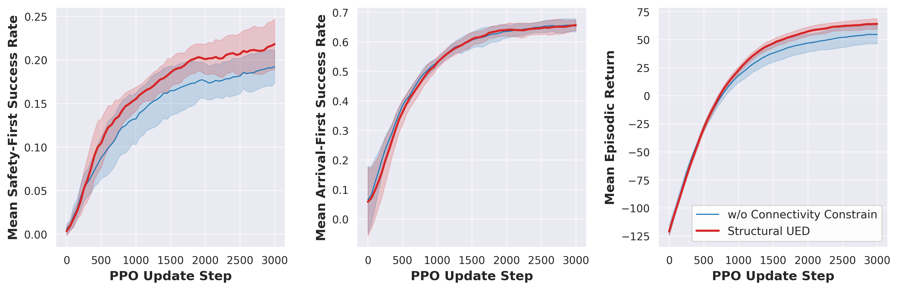
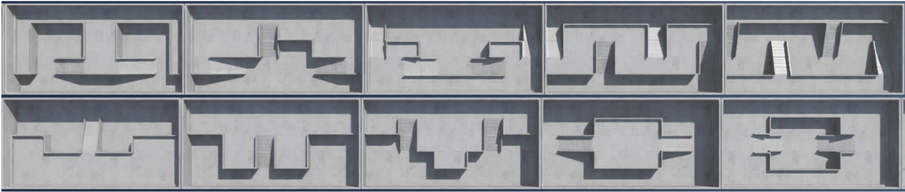

# CC-WFC
We put some experimental results here. 

*Table 2. Hyperparameters and experimental details.* 
|Parameters| Visual Navigation in IsaacLab|JaxNav|
|-|-:|-:|
|PPO|
|Number of Updates|3000|2250|
|$\gamma$ |0.99|0.99|
|$\lambda_{GAE}$ |0.95|0.95|
|PPO number of steps|24|512|
|PPO epochs|5|4|
|PPO minibatches per epoch|4|4|
|PPO clip range|0.2|0.04|
|PPO # parallel environments|256|256|
|Adam learning rate|1e-3|2.4e-4|
|PPO max gradient norm |1.0|0.5|
|PPO value clipping|yes|yes|
|Value loss coefficient|1.0|0.5|
|Entropy coefficient|0.005|0.0|
|Hidden dimension size|[512, 256, 128]|512|
|Structural UED|
|Replay rate, $p$|0.5|0.5|
|Buffer size, $K$ |32|1000|
|Prioritisation|Rank|Top K|
|Temperature, $\beta$|1.0|1.0|
|Staleness Coefficient|-|0.3|
|Regret Update Rate|20|1|
|Greediness Temperature, $T$|1.0|1.0|
|Grid Size|$10\times5$|$9\times9$|

> **Algorithm 1** Structural UED
**Input:** Level buffer size $K$, level generator
**Initialize:** Initialize policy $\pi(\phi)$, level buffer $\Lambda$, primitive-level regret matrix $R$

**while** *not converged* **do**  
&nbsp;&nbsp;&nbsp;&nbsp;Sample replay decision $d \sim P_D(d)$  

&nbsp;&nbsp;&nbsp;&nbsp;**if** $d = 0$ **then**  
&nbsp;&nbsp;&nbsp;&nbsp;&nbsp;&nbsp;&nbsp;&nbsp;(Optionally) Sample level $\theta$ from level generator guided by $R$  
&nbsp;&nbsp;&nbsp;&nbsp;&nbsp;&nbsp;&nbsp;&nbsp;*(Otherwise, sample unguided level $\theta$)*  
&nbsp;&nbsp;&nbsp;&nbsp;**else**  
&nbsp;&nbsp;&nbsp;&nbsp;&nbsp;&nbsp;&nbsp;&nbsp;Sample a replay level, $\theta \sim \Lambda$  
&nbsp;&nbsp;&nbsp;&nbsp;**end**  

&nbsp;&nbsp;&nbsp;&nbsp;Collect policy trajectory $\tau$ on $\theta$  
&nbsp;&nbsp;&nbsp;&nbsp;Update policy $\pi$ with rewards $\mathbf{R}(\tau)$  
&nbsp;&nbsp;&nbsp;&nbsp;Compute primitive-level regret from trajectory $\tau$  
&nbsp;&nbsp;&nbsp;&nbsp;Update regret matrix $R$ via Exponential Moving Average (EMA)  
&nbsp;&nbsp;&nbsp;&nbsp;Recompute the global regret score $S$ for all levels in $\Lambda$ using updated $R$  

&nbsp;&nbsp;&nbsp;&nbsp;**if** $d = 0$ **then**  
&nbsp;&nbsp;&nbsp;&nbsp;&nbsp;&nbsp;&nbsp;&nbsp;Compute overall regret score $S$ for the new level $\theta$ using updated $R$  
&nbsp;&nbsp;&nbsp;&nbsp;&nbsp;&nbsp;&nbsp;&nbsp;Update $\Lambda$ with $\theta$ if score $S$ meets threshold  
&nbsp;&nbsp;&nbsp;&nbsp;**end**  
**end**

**while** *not converged* **do**  
&nbsp;&nbsp;&nbsp;&nbsp;Sample replay decision $d \sim P_D(d)$  
&nbsp;&nbsp;&nbsp;&nbsp;**if** $d = 0$ **then**  
&nbsp;&nbsp;&nbsp;&nbsp;&nbsp;&nbsp;&nbsp;&nbsp;(Optionally) Sample level $\theta$ from level generator guided by $R$  
&nbsp;&nbsp;&nbsp;&nbsp;&nbsp;&nbsp;&nbsp;&nbsp;*(Otherwise, sample unguided level $\theta$)*  
&nbsp;&nbsp;&nbsp;&nbsp;**else**  
&nbsp;&nbsp;&nbsp;&nbsp;&nbsp;&nbsp;&nbsp;&nbsp;Sample a replay level, $\theta \sim \Lambda$  
&nbsp;&nbsp;&nbsp;&nbsp;**end**  
&nbsp;&nbsp;&nbsp;&nbsp;Collect policy trajectory $\tau$ on $\theta$  
&nbsp;&nbsp;&nbsp;&nbsp;Update policy $\pi$ with rewards $\mathbf{R}(\tau)$  
&nbsp;&nbsp;&nbsp;&nbsp;Compute primitive-level regret from trajectory $\tau$  
&nbsp;&nbsp;&nbsp;&nbsp;Update regret matrix $R$ via Exponential Moving Average (EMA)  
&nbsp;&nbsp;&nbsp;&nbsp;Recompute the global regret score $S$ for all levels in $\Lambda$ using updated $R$  
&nbsp;&nbsp;&nbsp;&nbsp;**if** $d = 0$ **then**  
&nbsp;&nbsp;&nbsp;&nbsp;&nbsp;&nbsp;&nbsp;&nbsp;Compute overall regret score $S$ for the new level $\theta$ using updated $R$  
&nbsp;&nbsp;&nbsp;&nbsp;&nbsp;&nbsp;&nbsp;&nbsp;Update $\Lambda$ with $\theta$ if score $S$ meets threshold  
&nbsp;&nbsp;&nbsp;&nbsp;**end**  
**end**

## The main experimental results are as follows:

Performance comparison of the proposed Structural UED and baselines on the hand-designed test terrain set

## The ablation results are as follows:

Ablation Study of fine-grained regret

Ablation Study of connectivity constrain

Ablation Study of graph-guided reward

**manually designed terrains**

