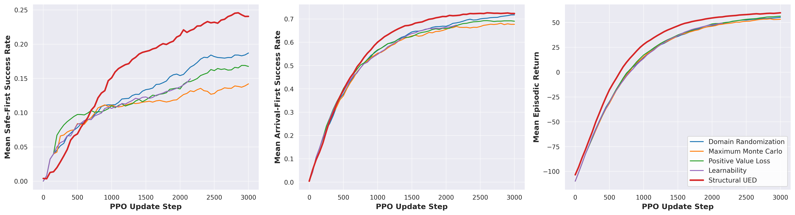
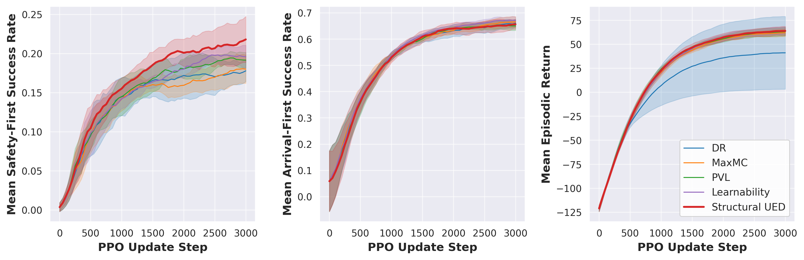
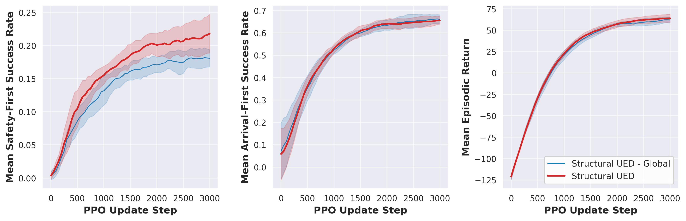
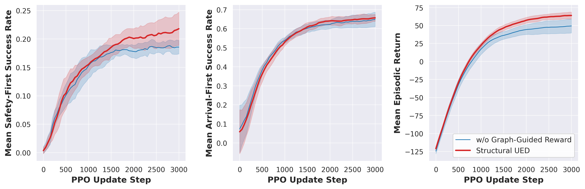

# CC-WFC
We put some experimental results here. 

*Table 2. Hyperparameters and experimental details.* 
|Parameters| Visual Navigation in IsaacLab|JaxNav|
|-|-:|-:|
|PPO|
|Number of Updates|3000|2250|
|$\gamma$ |0.99|0.99|
|$\lambda_{GAE}$ |0.95|0.95|
|PPO number of steps|24|512|
|PPO epochs|5|4|
|PPO minibatches per epoch|4|4|
|PPO clip range|0.2|0.04|
|PPO # parallel environments|256|256|
|Adam learning rate|1e-3|2.4e-4|
|PPO max gradient norm |1.0|0.5|
|PPO value clipping|yes|yes|
|Value loss coefficient|1.0|0.5|
|Entropy coefficient|0.005|0.0|
|Hidden dimension size|[512, 256, 128]|512|
|Structural UED|
|Replay rate, $p$|0.5|0.5|
|Buffer size, $K$ |32|1000|
|Prioritisation|Rank|Top K|
|Temperature, $\beta$|1.0|1.0|
|Staleness Coefficient|-|0.3|
|Regret Update Rate|20|1|
|Greediness Temperature, $T$|1.0|1.0|
|Grid Size|$10\times5$|$9\times9$|

**The main experimental results are as follows:**

**The ablation results are as follows:**

